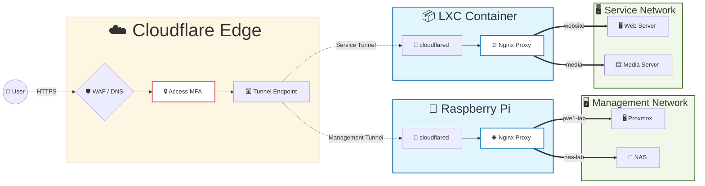

In a typical infrastructure, internal services are exposed using either a VPN, or port forwarding combined with a reverse proxy.

In my case, CGNAT on my home internet eliminates the possibility of port forwarding. Additionally, restrictive networks (such as corporate environments) often block VPN traffic. Together, these constraints require a different approach to ingress.

To address this, I designed and automated a gateway layer using Cloudflared and Nginx, managed using Ansible as Infrastructure as Code (IaC). This allows service exposure and routing to be defined declaratively, with consistent deployment, validation, and minimal manual intervention.



## Problem

My setup is constrained by the following:

- **No inbound connectivity**: CGNAT prevents exposing services via traditional port forwarding.
- **VPN is not universally reliable**: Some networks block or interfere with VPN-based access (including tools like Tailscale), making it unsuitable as a primary access method.
- **Secure control plane access is required**: Administrative access (SSH, server GUI, network interfaces) must be exposed in a tightly controlled manner.  
- **User-facing services require a separate access model**: Applications need to be reachable externally with reasonable security, but without the same level of restriction as the control plane.

As a result, the ingress solution must:

- operate without inbound connections,
- support restricted network environments,
- and enforce clear separation between control plane and user traffic.

With these constraints in mind, the following design decisions were made:
## Design Decisions

### Static IP

One option was to obtain a static IP and expose services directly via port forwarding.

While this simplifies the architecture, it introduces direct exposure of the home network to the internet, including automated scanning, bot traffic, and potential denial-of-service scenarios. It also tightly couples external availability to the stability of the home environment.

Given these tradeoffs, I avoided direct exposure and opted for an outbound-based ingress model.
### Tailscale Usage
Tailscale with route publishing is used as a fallback access method.

However, in restrictive environments, UDP traffic and known VPN protocols are often blocked. This makes it unreliable as a primary access mechanism.

As a result, it is retained for redundancy, but not used as the main ingress path.
### Cloudflare Tunnel
Cloudflare Tunnel provides an outbound-only connectivity model, allowing services to be exposed without opening inbound ports.

This directly addresses the CGNAT constraint while preventing direct exposure of the origin infrastructure. Additionally, it enables integration with Cloudflare Access, allowing authentication, geo restrictions, and rate limiting to be enforced at the edge.

This makes it suitable as the primary ingress layer.
### Nginx
Nginx is used as the internal reverse proxy to handle service-level routing.

Keeping routing logic inside the network allows the external tunnel layer to remain minimal, while service-specific configuration is handled per-service.

### Separate User and Control Plane
Management access and user-facing services are isolated to reduce risk and operational interference.

This is implemented using two separate environments:

- **Management proxy** handling SSH and administrative interfaces like server GUIs
- **Application proxy** handling user services

The control plane is protected using Cloudflare Access, with additional controls such as geo-based filtering and rate limiting.

This separation reduces blast radius and prevents public traffic from impacting management access.
### Explicit Subdomain Mapping (No Wildcard)

A wildcard (\*.domain.com) configuration was considered to simplify service exposure.

However, wildcard routing increases the risk of unintentionally exposing services and reduces visibility over what is publicly accessible.

Given the relatively small number of services, explicit subdomain mapping was chosen instead. This keeps exposure intentional, auditable, and easier to control.

### Infrastructure as Code and Automation

The ingress layer is managed through Ansible to ensure consistency and reduce configuration drift.

Service definitions are centralized, and Nginx configurations are generated from templates rather than maintained manually. This becomes particularly important as the number of services grows, where manual configuration would introduce inconsistency and increase operational risk.

Operational tasks are separated into distinct stages. In particular, Nginx installation and Nginx proxy configuration are handled independently. This avoids unnecessary checks and package operations during routine updates, allowing faster and more targeted changes when only routing configuration is modified.


**Main deployment file**:
```
---
- name: Deploy App-Proxy Gateway
  hosts: app_proxy
  become: true
  vars_files:
    - vars/services.yaml
  vars:
    cloudflared_token: "{{ lookup('env', 'CLOUDFLARED_TOKEN') }}"

  tasks:
    - name: Run Cloudflare Infrastructure Tasks
      import_tasks: tasks/cloudflared.yaml
      tags: infra

    - name: Install Nginx
      import_tasks: tasks/nginx_install.yaml
      tags: nginx_install

    - name: Update & run Nginx proxy
      import_tasks: tasks/nginx_proxy.yaml
      tags: nginx_proxy

  handlers:
    - name: Restart cloudflared
      service:
        name: cloudflared
        state: restarted

    - name: Reload nginx
      service:
        name: nginx
        state: reloaded
    
    - name: Reload systemd daemon
      systemd:
        daemon_reload: yes
```

Task files can be seen in: [[https://github.com/atakan-erdonmez/homelab/tree/main/infrastructure/app_proxy/tasks|GitHub]]

## Implementation

The final setup is implemented as an Ansible-managed ingress gateway.

Two Cloudflare tunnels are used:

- The **control plane tunnel** runs on the Raspberry Pi (Docker-based) and handles management access
- The **application tunnel** runs inside a dedicated Proxmox LXC container and handles user-facing services

Nginx runs alongside each tunnel and handles internal routing.

Each service is assigned its own subdomain in Cloudflare. Incoming requests are routed through the appropriate tunnel and then forwarded to Nginx, which directs traffic to the correct service.

Instead of managing Nginx configurations manually, services are defined in a central location. Configuration files are generated automatically from templates using Jinja2, ensuring consistency across services.

When changes are made, only the relevant configurations are updated. Before reloading Nginx, the configuration is validated to prevent invalid changes from causing downtime.

The playbook is structured to separate initial setup from ongoing configuration changes. This allows updates to be applied without re-running unnecessary tasks.

> The full configuration and playbooks are available in the repository:  
> [App Proxy](https://github.com/atakan-erdonmez/homelab/tree/main/infrastructure/app_proxy) & [Management Proxy](https://github.com/atakan-erdonmez/homelab/tree/main/infrastructure/management_proxy)
## Final Architecture

The resulting system consists of two isolated ingress paths:

- A **control plane path**, exposed through Cloudflare Tunnel and protected by Cloudflare Access, providing secure administrative access
- A **user-facing path**, exposed through a separate tunnel and routed internally via Nginx

External access is always initiated outbound, avoiding inbound exposure entirely. Routing logic is handled internally, while security controls are enforced at the edge.

This creates a layered model where:

- Cloudflare handles exposure and edge security
- Nginx handles internal routing
- Ansible maintains configuration consistency

## Lessons Learned
- Cloudflared networking behavior differs between Docker bridge and host mode, which can break localhost routing if not handled explicitly
- Separating tunnels across nodes simplified isolation but increased coordination complexity during initial setup

## Conclusion

This setup evolved from a simple requirement, exposing services behind CGNAT, into a structured ingress system with clear separation, controlled exposure, and automated management.

Rather than relying on a single tool, the design focuses on how components interact: Cloudflare for secure exposure, Nginx for internal routing, and Ansible for consistency and repeatability.

The result is not just a working solution, but a system that can be extended, maintained, and reasoned about as it grows.
